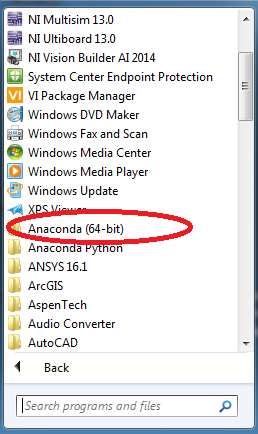
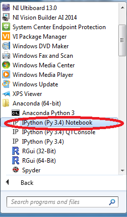

These are instructions for getting the right version of Python on the CICS managed desktop.

Notes by [Mike Croucher](http://www.walkingrandomly.com)

There are several versions of Python on the managed desktop. We are using Python 3.

**Use the correct version of Anaconda Python**

Depending on who else has used the machine you are working on, you may
see one, two or no entries for Anaconda on the start menu. If you see
two, the one you need is **Anaconda (64bit)** on the start menu. This
uses Python version 3.4 and IPython notebook version 3.2.

The entry called **Anaconda Python** is old and not recommended.

If you see no entries on the start-menu, you will need to install
Anaconda. Double click on **Software Center** on the desktop and under
the **Available Software** tab find **Anaconda-Python-3-Install**.Tick
the box to the left and click on **Install Selected**. Installation may
take up to 20 minutes but will probably only need to be done once per
machine.

**IPython notebook version**

Launch the notebook by clicking on **Anaconda Python (64 bit) -&gt;
IPython (Py3.4) Notebook**

Check the version of the IPython notebook using the following commands
inside the notebook

**import IPython**

**IPython.\_\_version\_\_**

If the result is 3.2, you are using the default Managed desktop install
of IPython. If it is lower than 3.2, you are using the wrong version of
Anaconda!

It is possible for you to upgrade **your** version of the notebook to
the latest one if you wish. This upgrade does not modify the machine,
instead it adds the new version to your network U: Drive

**Upgrading the notebook**

Close all instances on the firefox web browser and IPython notebook.

Launch the **Anaconda Python 3** command prompt

Execute the command

**pip install jupyter**

This may take a few minutes. Launch the notebook again and execute the
following inside a Python 3 kernel

**import IPython**

**IPython.\_\_version\_\_**

If you get version 4.0 or above, the upgrade was successful.

**Installing additional packages**

Using **pip** inside the **Anaconda Python 3** command prompt**,** you
can install any Python package you wish. E.g.

**pip install pods**

**If things go wrong**

When you install anything following these instructions, the packages
will be installed in your U:Drive. They will be the the folder
**U:\\Python34.**

If you find that the system is in an unusuable state, delete this folder
and your version of Anaconda Python will return to the default version
packaged by CiCS.
